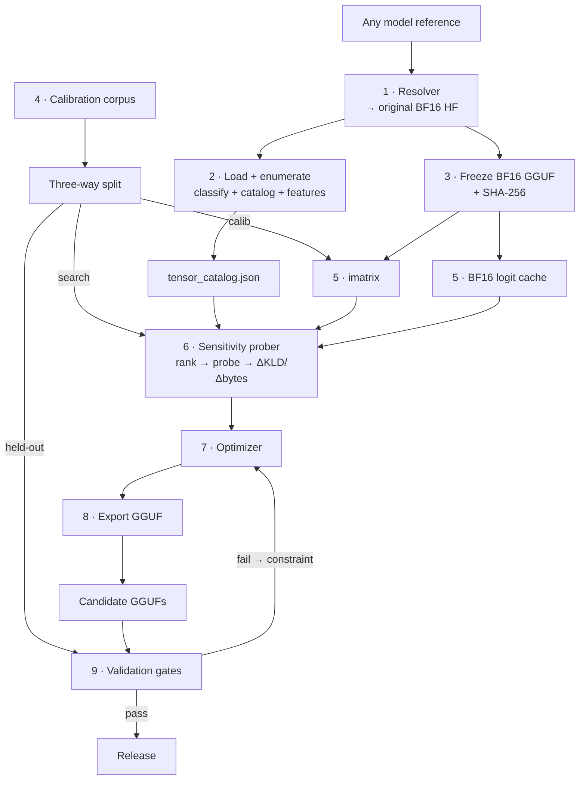

<div align="center">


# OpenDynamicGGUF

**Dynamic per-tensor mixed-precision GGUF quantization — for any model.**

<p>An open, reproducible, measurement-driven optimizer that picks the best quantization type for every tensor group in a model — under your size or VRAM budget.</p>

<p>
  
  
  
  
  
</p>

<p>
  <a href="#quick-start">Quick start</a> ·
  <a href="#how-it-works">How it works</a> ·
  <a href="#project-status">Status</a> ·
  <a href="docs/steps/README.md">Step-by-step docs</a> ·
  <a href="#roadmap">Roadmap</a> ·
  <a href="#contributing">Contributing</a>
</p>

</div>

---

## Overview

Give OpenDynamicGGUF any model reference — a Hugging Face repo, an Ollama tag like `functiongemma:latest`, an MLX repo like `gemma4:e2b-mlx`, or a local checkpoint — and it traces it back to the original full-precision weights, measures how sensitive each tensor group is to quantization, and searches for the bit assignment that costs the least quality per byte saved.

```bash
odg quantize --model functiongemma:latest --target-size 3.2GB

  → functiongemma-UD.gguf     # the dynamic-quantized model
  → recipe.yaml               # fully reproducible quantization recipe
  → report.html               # KLD / perplexity / benchmark validation report
```

Instead of a uniform preset like `Q4_K_M`, the output is a **recipe** — a measured, explainable, per-tensor-group bit assignment:

```text
token_embd            -> Q8_0     (pinned: touched by every token)
attn_v    (all)       -> Q6_K     (pinned: high sensitivity, small size)
attn_q/k  (early)     -> Q5_K
attn_q/k  (mid/late)  -> Q4_K
ffn_gate  (mid)       -> Q3_K     (cheap bits: large tensor, low sensitivity)
ffn_up    (mid)       -> Q3_K
ffn_down  (all)       -> Q4_K
output                -> Q8_0     (pinned)
```

> [!IMPORTANT]
> This project is in **alpha**. Steps **00–08** are implemented and usable today (resolve → load → enumerate → classify → catalog → weight features → calibration corpus → activation features). `odg quantize` is the target end-to-end command and lands with milestone M3. See [Project status](#project-status).

### What makes it different

| | Uniform presets (`Q4_K_M`, …) | Closed dynamic quants | **OpenDynamicGGUF** |
|---|---|---|---|
| Per-tensor bit assignment | No | Yes | Yes |
| Heuristics are readable code | n/a | No | **Yes** |
| Ships a recipe that rebuilds the file bit-for-bit | No | No | **Yes** |
| Every bit decision traced to a measured number | No | Undisclosed | **Yes (ΔKLD probe)** |
| Validated on data the search never saw | No | Undisclosed | **Yes (3-way split + gates)** |

---

## Table of contents

- [Overview](#overview)
- [Quick start](#quick-start)
- [Project status](#project-status)
- [How it works](#how-it-works)
- [Why this project exists](#why-this-project-exists)
- [Design principles](#design-principles)
- [Architecture deep dive](#architecture-deep-dive)
  - [Stage 1 — Universal model resolver](#stage-1--universal-model-resolver)
  - [Stage 2 — Load, classify, catalog, features](#stage-2--load-classify-catalog-features)
  - [Stage 3 — Ingest & freeze GGUF reference](#stage-3--ingest--freeze-gguf-reference)
  - [Stage 4 — Calibration corpus & the three-way split](#stage-4--calibration-corpus--the-three-way-split)
  - [Stage 5 — Reference artifacts](#stage-5--reference-artifacts-compute-once)
  - [Stage 6 — Sensitivity probing](#stage-6--sensitivity-probing)
  - [Stage 7 — Recipe optimizer](#stage-7--recipe-optimizer)
  - [Stage 8 — Reproducible export](#stage-8--reproducible-export)
  - [Stage 9 — Validation gates](#stage-9--validation-gates)
- [One pipeline, every architecture](#one-pipeline-every-architecture)
- [Recipe format](#recipe-format)
- [Repository layout](#repository-layout)
- [Roadmap](#roadmap)
- [Cost & hardware expectations](#cost--hardware-expectations)
- [Related work & references](#related-work--references)
- [Contributing](#contributing)
- [License](#license)

---

## Quick start

### Requirements

- Python **3.10+**
- A [`llama.cpp`](https://github.com/ggml-org/llama.cpp) build (needed from Stage 3 onward: `convert_hf_to_gguf.py`, `llama-imatrix`, `llama-quantize`, `llama-perplexity`)
- Optional: [Ollama](https://ollama.com) if you want to resolve Ollama tags from a local install

### Install

```bash
git clone https://github.com/imrrohitt/OpenDynamicGGUF.git
cd OpenDynamicGGUF

python -m venv .venv && source .venv/bin/activate
pip install -e .
```

### Run the pipeline that exists today

Every step is checkpointed to a filesystem run store, so you can stop and resume at any point.

```bash
# 01 · any reference → original full-precision checkpoint + architecture descriptor
odg resolve --model functiongemma:latest

# 02–05 · open the model, inventory tensors, assign roles, build the catalog
odg load        --model functiongemma:latest
odg enumerate   --model functiongemma:latest
odg classify    --model functiongemma:latest
odg catalog     --model functiongemma:latest

# 06 · weight statistics (no calibration text required)
odg weight-features --model functiongemma:latest --only-quantizable

# 07 · mixed calibration corpus, split into calib / search / held-out
odg corpus --model functiongemma:latest --target-tokens 300000

# 08 · activation stats from the calib split (forward hooks if possible, else proxy)
odg activation-features --model functiongemma:latest

# inspect progress
odg status --model functiongemma:latest
odg runs
```

Artifacts land under `artifacts/runs/<run-id>/steps/<step>/`, each with its `input.json`, `output.json`, `status.json`, and a log. Re-running a completed step is a no-op unless you pass `--force`; `--new-run` starts a fresh run instead of resuming the current one.

Useful flags:

| Flag | Effect |
|---|---|
| `--download-weights` | Fetch the resolved weights instead of only recording the reference |
| `--prefer-hf` | For Ollama tags, use the upstream Hugging Face BF16 rather than the local GGUF |
| `--run <id>` / `--new-run` | Resume a specific run, or force a new one |
| `--force` | Recompute a step that is already checkpointed as done |
| `--only-quantizable` | Skip norms and other non-quantizable tensors when computing features |
| `--target-tokens` / `--seed` | Corpus size budget and split seed for `odg corpus` |
| `--mode auto\|forward\|proxy` | Activation-features strategy (`auto` tries a real forward pass, else proxy) |
| `--max-docs` | Cap how many calib docs are used in a forward activation pass |
| `--no-explain` | Suppress the human-readable explanation printed after each step |

---

## Project status

The pipeline is split into 16 small steps, each with its own design doc. Start at **[`docs/steps/README.md`](docs/steps/README.md)**.

| # | Step | Doc | CLI | State |
|---|---|---|---|---|
| 00 | Checkpoint store | [doc](docs/steps/00-checkpoint-store.md) | `odg status`, `odg runs` | ✅ Implemented |
| 01 | Resolve model ref | [doc](docs/steps/01-resolve-model.md) · [impl](docs/steps/01-resolve-model-impl.md) | `odg resolve` | ✅ Implemented |
| 02 | Load model | [doc](docs/steps/02-load-model.md) · [impl](docs/steps/02-load-model-impl.md) | `odg load` | ✅ Implemented |
| 03 | Enumerate tensors | [doc](docs/steps/03-enumerate-tensors.md) | `odg enumerate` | ✅ Implemented |
| 04 | Classify tensors | [doc](docs/steps/04-classify-tensors.md) | `odg classify` | ✅ Implemented |
| 05 | Build tensor catalog | [doc](docs/steps/05-build-tensor-catalog.md) | `odg catalog` | ✅ Implemented |
| 06 | Weight features | [doc](docs/steps/06-compute-weight-features.md) | `odg weight-features` | ✅ Implemented |
| 07 | Calibration corpus | [doc](docs/steps/07-build-calibration-corpus.md) | `odg corpus` | ✅ Implemented |
| 08 | Activation features | [doc](docs/steps/08-compute-activation-features.md) | `odg activation-features` | ✅ Implemented (proxy; forward optional) |
| 09 | Freeze BF16 GGUF | [doc](docs/steps/09-freeze-bf16-gguf.md) | `odg freeze-gguf` | ✅ Implemented (promote; HF convert optional) |
| 10 | Build imatrix | [doc](docs/steps/10-build-imatrix.md) | `odg imatrix` | ✅ Implemented (proxy; llama-imatrix optional) |
| 11 | Cache reference logits | [doc](docs/steps/11-cache-reference-logits.md) | — | 🚧 Planned |
| 12 | Sensitivity probe | [doc](docs/steps/12-sensitivity-probe.md) | — | 🚧 Planned |
| 13 | Optimize recipe | [doc](docs/steps/13-optimize-recipe.md) | — | 🚧 Planned |
| 14 | Export GGUF | [doc](docs/steps/14-export-gguf.md) | — | 🚧 Planned |
| 15 | Validate & release | [doc](docs/steps/15-validate-and-release.md) | — | 🚧 Planned |

The sections below are the condensed architecture. For teachable detail, worked examples, and per-step checklists, use the step files.

---

## How it works

```text
User model ref (Ollama / MLX / HF / local)
        │
        ▼
1 · Resolve to original BF16 safetensors
        │
        ▼
2 · Load model → enumerate state_dict → classify roles → tensor catalog → features
        │
        ▼
3 · Freeze BF16 GGUF (+ SHA-256)     ← llama.cpp execution path
        │
        ▼
4 · Calibration corpus (3-way split)
        │
        ▼
5 · Reference artifacts (imatrix + BF16 logits)
        │
        ▼
6 · Sensitivity: features rank → trial quant → measure ΔKLD
        │
        ▼
7 · Optimizer (bytes_saved / ΔKLD under budget)
        │
        ▼
8 · Export GGUF from recipe
        │
        ▼
9 · Validation gates → release
```



**Two views of the same weights:** Stage 2 loads the checkpoint in PyTorch to *inspect* every tensor (catalog + features). Stage 3 converts the same checkpoint to a frozen BF16 GGUF so *probes and export* run through llama.cpp. Both must share the same source SHA / content hash.

---

## Why this project exists

The ecosystem has excellent quantization *methods* (GPTQ, AWQ, k-quants, IQ formats, imatrix) but no broadly adopted, **open** *automatic quantization optimizer* — a tool that, given a target size or memory budget, discovers the best tensor-wise precision assignment and exports a ready-to-use GGUF.

Unsloth's Dynamic 2.0 GGUFs proved the value of the idea: selectively assigning different bit-widths per tensor, guided by a curated calibration set and KL-divergence measurements, beats uniform quantization — especially for MoE models, where dynamic quantization has become the de-facto standard. But their exact heuristics and pipeline are proprietary. This project builds an open, reproducible, measured alternative:

- **Open** — every heuristic is code you can read.
- **Reproducible** — every released GGUF ships with a `recipe.yaml` that rebuilds it bit-for-bit.
- **Measured** — every bit decision traces back to a number produced by a sensitivity probe, not a hand-wave.

Crucially, we do **not** reimplement quantization kernels. `llama.cpp` already provides everything needed at the execution layer:

| Capability | llama.cpp tool |
|---|---|
| HF → GGUF conversion | `convert_hf_to_gguf.py` |
| Importance matrix from calibration text | `llama-imatrix` |
| Per-tensor quantization overrides (regex supported) | `llama-quantize --tensor-type`, `--tensor-type-file` |
| Embedding / output overrides | `--token-embedding-type`, `--output-tensor-type` |
| KL-divergence vs. full-precision logits | `llama-perplexity --kl-divergence-base` / `--kl-divergence` |
| Size estimation without writing files | `llama-quantize --dry-run` |

OpenDynamicGGUF is the **measurement, search, and validation loop around these tools**.

---

## Design principles

1. **Never requantize quantized weights.** Quantization error compounds. Every input reference is traced back to its original full-precision source before anything else happens.
2. **KL divergence to the full-precision model is the primary objective** — not perplexity alone, and not benchmark scores during search. Logit-level fidelity is cheap to compute, sensitive, and doesn't saturate.
3. **Statistics prioritize; probes decide.** Features come from two sources: **weights** (read from the tensor) and **activations** (from running real calibration text through the model). Both are used only to *rank* groups and pick which bit-widths to try first — never as the final accept/reject rule. Two layers can share identical weight stats and still diverge wildly after quantization; only measured ΔKLD is authoritative.
4. **Hard wall between search data and judging data.** The optimizer never sees the data it will be validated on. This is the single rule that keeps results honest instead of overfit to their own calibration set.
5. **Search over tensor groups, not individual tensors.** Role × depth grouping reduces ~300 tensors to ~25 groups, making the search tractable and the results interpretable.
6. **Everything is content-addressed and cached.** A re-run recomputes only what changed. Probes, logits, imatrices, and candidate GGUFs are keyed by the hash of their full input configuration.
7. **Gates are statistical where the metric is noisy.** Benchmark comparisons are paired per-question against the BF16 model with confidence intervals — never raw score thresholds.

---

## Architecture deep dive

### Stage 1 — Universal model resolver

The generalization that makes this work for *any* model: the pipeline never starts from what you typed — it starts from what the resolver traces it back to.

| You give it | What it actually is | Resolver action |
|---|---|---|
| `gemma4:e2b-mlx` | MLX repo — weights already 4-bit quantized | **Rejected as a source.** Traced to the original BF16 HF repo automatically |
| `functiongemma:latest` | Ollama tag → Q4 GGUF blob | Ollama manifest read; upstream fine-tune repo on HF resolved |
| `google/gemma-4-e2b-it` | BF16 safetensors on HF | Used directly |
| `./my-finetune/` | Local full-precision checkpoint | Used directly |

**Consumes:** any model reference.
**Produces:** BF16 safetensors + an *architecture descriptor* (family, layer count, MoE/SSM flags, chat template, specialty domain).
**Failure prevented:** requantizing already-quantized weights (MLX 4-bit, Ollama Q4). Quantization error compounds — no downstream search can recover it.

The architecture descriptor drives two later decisions: which tensor-role taxonomy to use ([per-architecture policies](#one-pipeline-every-architecture)) and which domain data/checks to add (e.g. function-calling traces and JSON-validity gates for a `functiongemma`-style fine-tune).

### Stage 2 — Load, classify, catalog, features

This is the **first analysis stage**. No quantization decisions happen here. The goal is to know every tensor in the model, what role it plays, and what its weight/activation features look like — so Stage 6 can prioritize probes intelligently.

#### 2a · Load the original BF16 model

```python
from transformers import AutoModelForCausalLM
import torch

model = AutoModelForCausalLM.from_pretrained(
    MODEL_PATH,                 # path from the resolver — never an MLX/Ollama quant
    torch_dtype=torch.bfloat16,
)
```

The complete network is now in memory as full-precision weights.

#### 2b · Enumerate every tensor

PyTorch exposes parameters (and registered buffers) via `state_dict()`:

```python
state = model.state_dict()

for name, tensor in state.items():
    print(name, tuple(tensor.shape), tensor.dtype)
```

Example names (Gemma / Llama-style):

```text
model.embed_tokens.weight
model.layers.0.self_attn.q_proj.weight
model.layers.0.self_attn.k_proj.weight
model.layers.0.self_attn.v_proj.weight
model.layers.0.self_attn.o_proj.weight
model.layers.0.mlp.gate_proj.weight
model.layers.0.mlp.up_proj.weight
model.layers.0.mlp.down_proj.weight
model.layers.0.input_layernorm.weight
model.norm.weight
lm_head.weight
```

Each line is **one tensor**. MoE / hybrid models add expert and SSM names; the catalog records whatever is present.

#### 2c · Tensor classification (role taxonomy)

Before computing features, classify each name into a **role**. This is more informative than treating all tensors identically — the optimizer (and humans) already know that attention-V is usually more sensitive than MLP-up.

| Role | Typical HF name patterns | Usually quantizable? |
|---|---|---|
| `embedding` | `embed_tokens`, `tok_embeddings` | Yes (often pinned high) |
| `attn_q` | `q_proj`, `wq` | Yes |
| `attn_k` | `k_proj`, `wk` | Yes |
| `attn_v` | `v_proj`, `wv` | Yes (often high sensitivity) |
| `attn_o` | `o_proj`, `wo` | Yes |
| `ffn_gate` | `gate_proj`, `w1` | Yes (often cheap bits) |
| `ffn_up` | `up_proj`, `w3` | Yes (often cheap bits) |
| `ffn_down` | `down_proj`, `w2` | Yes (medium) |
| `ffn_*_exps` | `*.experts.*` (MoE) | Yes |
| `router` | `gate`, `router` (MoE) | Pin / careful |
| `ssm_*` | hybrid / Mamba paths | Role-dependent |
| `norm` | `layernorm`, `rms_norm`, `norm` | Usually **skip** (leave F16/F32) |
| `lm_head` | `lm_head`, `output` | Yes (often pinned high) |

Also record **layer index** (and depth bucket: early / middle / late) when the name contains one. Role × depth is the grouping key used later (~25 groups instead of hundreds of tensors).

#### 2d · Build the tensor catalog

For every tensor, store metadata:

```text
name:     model.layers.12.self_attn.q_proj.weight
shape:    [640, 640]
dtype:    bfloat16
role:     attn_q
layer:    12
depth:    middle
nbytes:   …
gguf_name: blk.12.attn_q.weight   # mapped when known; used at export
quantizable: true
```

At this point you know **every tensor in the model** and how it maps into GGUF naming for `llama-quantize --tensor-type`.

#### 2e · Compute tensor features — two different data sources

Features are **not** all computed the same way. There are two kinds of data.

**Weight features (no external dataset)** come from the parameter tensor itself:

```text
Model → weight tensor → mean / variance / sparsity / entropy /
                        weight_norm / spectral_norm / outlier_ratio
```

No prompts required. Available as soon as the model is loaded.

**Activation features (require calibration text)** require a forward pass on real text:

```text
Calibration prompt → model → hidden activations → activation range,
                                                   channel importance,
                                                   which neurons fire hard
```

Without inference you only know weights. You do **not** know which neurons activate, which channels are unused, or which tensors matter for the model's real workload. Example: the same Layer-12 channel may sit near `0.2` on "What is AI?" and spike to `15.2` on "Write Python code" — that channel may deserve higher precision, and only activation stats reveal it.

| Metric | Source | Needs calibration text? |
|---|---|---|
| Mean, variance, sparsity, entropy, weight / spectral norm, weight outlier ratio | Weight tensor | No |
| Activation range, activation outliers, per-channel importance | Hidden states from forward pass | **Yes** |
| Importance matrix (`imatrix`) | Aggregated activations over calib corpus | **Yes** |
| ΔKLD / top-token agreement | BF16 logits vs quantized logits on search text | **Yes** (search split) |

Practical order: compute weight features in Stage 2 immediately; fill activation features after Stage 4 produces the calib split (hooks or a short PyTorch calib pass). `llama-imatrix` is the llama.cpp-side automation of the activation-importance path (see Stage 5).

These features feed **ranking only**. They do not accept or reject a bit-width by themselves (Stage 6).

#### 2f · Persist the catalog

Write a content-addressed artifact, e.g. `tensor_catalog.json`:

```json
{
  "model_source": "google/gemma-3-270m",
  "source_sha256": "…",
  "tensors": {
    "model.layers.12.self_attn.q_proj.weight": {
      "shape": [640, 640],
      "role": "attn_q",
      "layer": 12,
      "depth": "middle",
      "gguf_name": "blk.12.attn_q.weight",
      "quantizable": true,
      "weight_features": {
        "mean": 0.001,
        "variance": 0.05,
        "entropy": 6.8,
        "sparsity": 0.72,
        "outlier_ratio": 0.002,
        "weight_norm": 13.8,
        "spectral_norm": 2.9
      },
      "activation_features": {
        "range_min": -4.2,
        "range_max": 5.1,
        "outlier_ratio": 0.003
      }
    }
  }
}
```

**Consumes:** resolved BF16 HF path + architecture descriptor (+ calib split once available for activations).
**Produces:** `tensor_catalog.json` (names, roles, shapes, weight/activation features, GGUF name map).
**Failure prevented:** probing "blind" without knowing which tensors exist, which roles they play, or which names to pass to `--tensor-type`.

### Stage 3 — Ingest & freeze GGUF reference

Same resolved checkpoint, second representation — for the llama.cpp path:

```bash
python llama.cpp/convert_hf_to_gguf.py ./model-src --outtype bf16 --outfile model-bf16.gguf
sha256sum model-bf16.gguf   # recorded in every downstream artifact
```

**Consumes:** BF16 safetensors + architecture descriptor.
**Produces:** `model-bf16.gguf` (frozen reference) + SHA-256.
**Failure prevented:** sensitivity measured on one build while export runs on another — results become silently incomparable and the recipe stops being reproducible.

Probing, export, and validation all derive from these exact GGUF bytes. The catalog from Stage 2 must point at the same source.

### Stage 4 — Calibration corpus & the three-way split

This is one of the **most important** parts of the project. Activation statistics, the importance matrix, and KL divergence are **not** computed on random noise or from weights alone — they require running real text through the model.

```text
Prompt  →  Model  →  Hidden activations / logits  →  Stats, imatrix, ΔKLD
```

That text is the **calibration corpus**.

#### Why text is required

Weights alone never answer:

- Which neurons activate on real workloads?
- Which channels spike (and may need higher precision)?
- Which experts fire (MoE)?
- How much does quantizing group X shift the output distribution?

Only a forward pass on representative prompts reveals that.

#### What the corpus looks like

A calibration file is plain text — thousands of prompts concatenated, ideally rendered with the model's **chat template** for instruct models:

```text
User:
Explain quantum mechanics.
Assistant:
…

User:
Write a Python function that merges two sorted lists.
Assistant:
…
```

There is no single standard dataset. Community GGUF builders commonly mix WikiText, C4, code, chat, math, and multilingual text. OpenDynamicGGUF is more deliberate than Wikipedia-only:

| Domain | Target share | Why |
|---|---|---|
| Conversation / chat | ~30% | Matches instruct use |
| Code | ~30% | Stresses different channels than prose |
| Math / reasoning | ~20% | Exact-answer sensitivity |
| Multilingual | ~10% | Avoid English-only activation bias |
| Domain-specific | ~10% | From resolver metadata |

**Domain examples:** for `functiongemma`, domain data = real function-calling traces (tool schemas + model responses) rendered in its chat template so activations match the intended workload. For a code-specialized fine-tune, lean harder on code.

- **Scale:** roughly 0.3M–1.5M tokens depending on model size.
- **Chat-template rendered:** raw wikitext never exercises the format instruct models actually see — a documented weakness of many community imatrix quants.

#### Three-way split (hard walls)

| Split | Share | Used by | Purpose |
|---|---|---|---|
| **calib** | ~60% | `llama-imatrix`, activation-feature hooks | Guides rounding + fills activation stats |
| **search** | ~20% | Sensitivity prober & optimizer | ΔKLD objective during search |
| **held-out** | ~20% | Validation gates **only** | Search never touches it |

**Failure prevented:** calibrating and evaluating on the same distribution (Wikipedia in → Wikipedia KLD out looks better than it is).

#### Complete picture: weights vs activations vs KL

```text
                    BF16 Model
                         │
          ┌──────────────┴──────────────┐
          │                             │
   Weight tensors                Calibration / search text
          │                             │
          ▼                             ▼
   Mean, variance                 Forward pass
   Entropy, sparsity                    │
   Weight / spectral norms              ▼
   Weight outlier ratio          Hidden activations ──► activation range,
                                                         channel importance
                                                         imatrix (llama-imatrix)
                                Logits (BF16 vs quant) ──► ΔKLD, top-token agree
```

- **Weight statistics** ← parameter tensors (no dataset).
- **Activation statistics + imatrix** ← calib text through the model.
- **KL divergence** ← comparing BF16 vs quantized **logits** on search/held-out text — not from the weights themselves.

### Stage 5 — Reference artifacts (compute once)

Two expensive full-precision artifacts are computed exactly once and cached for every candidate that follows.

`llama-imatrix` automates the activation-importance path over the calib split:

```text
calib.txt  →  forward pass  →  collect / average activations  →  imatrix.gguf
```

`llama-quantize` later uses that file so rounding inside each tensor is guided by how the model actually activates — not by uniform assumptions.

```bash
# Importance matrix (activation-based; guides rounding within each tensor)
./llama-imatrix -m model-bf16.gguf -f calib.txt -o imatrix.gguf

# Reference logits (the thing every candidate is compared against)
./llama-perplexity -m model-bf16.gguf -f search.txt   --kl-divergence-base logits-search.bin
./llama-perplexity -m model-bf16.gguf -f heldout.txt  --kl-divergence-base logits-heldout.bin
```

**Failure prevented:** re-running the full-precision forward pass per candidate — the cost that makes naive search infeasible on a single workstation.

### Stage 6 — Sensitivity probing

This is the heart of OpenDynamicGGUF. It starts from the **tensor catalog** (Stage 2): groups already classified by role × depth, features already computed. Those features **prioritize** which groups and bit-widths to trial first; probes **decide**.

#### Why statistics alone are not enough

Two layers can look identical on paper:

```text
Layer A / Layer B
  Mean = 0    Variance = 0.05    Sparsity = 80%    Norm = 15
```

After the same Q4 probe, Layer A may show ΔKLD ≈ 0.002 (fine) while Layer B shows ΔKLD ≈ 0.12 (catastrophic). Thresholds like `if variance < 0.1 then compress` cannot see this. The true signal is **the model's sensitivity to quantizing that group**, measured by changing only that group and observing the shift in output distributions.

| Role of tensor features | Role of the probe |
|---|---|
| Mean, variance, sparsity, outlier ratio, activation range, weight / spectral norm, entropy | Trial-quantize one group; keep everything else BF16; measure ΔKLD on the search split |
| Used to **estimate difficulty** and **rank / prioritize** which groups and bit-widths to try first | Used to **accept / reject** and to fill the `(group, quant) → (Δbytes, ΔKLD)` table the optimizer consumes |

Features say *"probably easy"* or *"probably hard"*. The probe says *"how much quality you actually lose per byte saved."*

#### Probe pipeline (per group)

Grouping is already done in the catalog (Stage 2c): **role × depth bucket**. Norms and other non-quantizable entries are skipped. That yields **~25 probe groups** instead of hundreds of individual tensors.

```text
Tensor catalog (roles + features already stored)
      │
      ▼
Estimate sensitivity score   from catalog features
                             (variance, outliers, spectral norm, …)
      │
      ▼
Rank groups + choose trial bit-widths   (Q2 / Q3 / Q4 / Q5 / Q6…)
      │
      ▼
Trial quantization          only this group; rest stays BF16
                            (regex / --tensor-type from gguf_name map)
      │
      ▼
Run search-split prompts    BF16 logits (cached) vs probe logits
      │
      ▼
Measure ΔKLD, top-token agreement, Δbytes
      │
      ▼
Record  bytes_saved / ΔKLD  ← what the optimizer actually maximizes
```

Concrete trial (only mid-layer `ffn_up` lowered):

```bash
./llama-quantize --imatrix imatrix.gguf \
    --tensor-type "\.(1[0-9])\.ffn_up=q3_k" \
    model-bf16.gguf probe-ffnup-mid.gguf q6_k

./llama-perplexity -m probe-ffnup-mid.gguf \
    --kl-divergence-base logits-search.bin --kl-divergence
```

How features help without becoming the decision:

```text
High sparsity + low variance + few outliers                  →  try Q3 first (probably easy)
Huge activation range + large spectral norm + many outliers  →  start at Q5/Q6 (probably hard)
```

If the Q3 probe returns ΔKLD ≈ 0.003 → keep Q3. If it returns ΔKLD ≈ 0.12 → reject and try Q4 / Q5. The sensitivity score never overrides a measured bad ΔKLD.

#### Output — the sensitivity table

`(group, quant_type) → (Δbytes, ΔKLD)`. Δbytes is computed analytically from bits-per-weight × tensor shapes (`--dry-run` as a cross-check). Illustrative shape for a ~4B dense model:

| Tensor group | Probe | Size saved | ΔKLD (mean) | Decision |
|---|---|---|---|---|
| `ffn_up` · mid layers | Q4_K → Q3_K | −310 MB | +0.004 | Accept downgrade |
| `ffn_gate` · mid layers | Q4_K → Q3_K | −305 MB | +0.005 | Accept downgrade |
| `ffn_down` · mid layers | Q4_K → Q3_K | −180 MB | +0.019 | Keep Q4_K |
| `attn_v` · all layers | Q6_K → Q4_K | −45 MB | +0.037 | Pin Q6_K |
| `token_embd` | Q8_0 → Q4_K | −190 MB | +0.055 | Pin Q8_0 |

*Illustrative values — real numbers come from your probe run. Large MLP tensors often buy cheap savings; attention and embeddings often buy expensive regret — but we only believe that after measuring.*

**Failure prevented:** (1) blind search over an enormous per-tensor space, (2) false confidence from statistic thresholds that miss high-sensitivity layers with "easy-looking" distributions.

### Stage 7 — Recipe optimizer

Bit assignment under a byte budget is (approximately) a **knapsack problem**:

1. **Greedy phase** — repeatedly downgrade the group with the best ratio of *bytes saved per unit of KLD incurred* until the size/VRAM budget is met. Per-group effects are roughly additive, so greedy gets ~90% of the way.
2. **Refinement phase** — short local search (single-group swaps, ±1 quant level) with *joint* measurement: quantize the full candidate and measure real KLD, correcting for interaction effects the additivity assumption misses.
3. **Output** — not one config, but the top few candidates along the **size ↔ quality Pareto frontier**.

v1 deliberately skips Bayesian optimization and evolutionary search: each objective evaluation costs a quantize + eval pass, and the published evidence says greedy-plus-refinement captures what matters. Fancier search is a later experiment, not a prerequisite.

**Failure prevented:** a single opaque config. Emitting the whole frontier lets the user pick the trade-off and keeps every choice auditable.

### Stage 8 — Reproducible export

A recipe is rendered into a `--tensor-type-file` and executed:

```bash
./llama-quantize --imatrix imatrix.gguf --tensor-type-file recipe.tt \
    --token-embedding-type q8_0 --output-tensor-type q8_0 \
    model-bf16.gguf model-UD.gguf q4_k_m
```

The recipe carries the **model hash, imatrix hash, and every group assignment**, so anyone can rebuild the GGUF bit-for-bit. Provenance metadata is embedded in the output file via `--override-kv`.

**Failure prevented:** "trust me" quants. Full reproducibility is this project's differentiator against closed dynamic-quant pipelines.

### Stage 9 — Validation gates

Three cost-ordered tiers, **all on data the search never saw**. A candidate ships only after passing every gate.

**Tier 1 — Logit fidelity** *(every candidate · minutes)* — `llama-perplexity --kl-divergence` against the cached BF16 logits on the held-out split.

- **mean KLD** — overall fidelity
- **99.9th-percentile KLD** and **max KLD** — a good mean can hide catastrophic single-token failures; the tail gates catch them
- **top-token agreement rate** — fraction of positions where the quant's argmax matches BF16

**Tier 2 — Behavioral smoke** *(Pareto-frontier candidates · ~1 hour)*

- Perplexity on an unrelated public set (different from anything used in calibration)
- Generation battery: chat coherence, code that must compile, exact-answer math, long-context retrieval
- Domain checks from resolver metadata — e.g. every emitted tool call must be schema-valid JSON for a function-calling model

Catches failure modes logit metrics miss: broken chat-template handling, degenerate repetition, formatting collapse.

**Tier 3 — Benchmarks** *(final 1–2 candidates · hours)* — MMLU / GSM8K / HumanEval via lm-eval-harness. The gate is **statistical**: paired per-question comparison against the BF16 model, required to sit inside the confidence interval. Never a raw score threshold — benchmark noise would randomly pass and fail good quants.

**Feedback loop:** a gate failure returns to the optimizer as a concrete constraint, not a blind restart. A max-KLD breach is traced to the group that caused it (the sensitivity table makes the lookup trivial), that group is pinned one precision level higher, and the search re-runs — from cache, so only changed artifacts are recomputed.

**Failure prevented:** shipping a quant that only looks good on its own calibration data — the exact overfitting failure this whole design exists to avoid.

---

## One pipeline, every architecture

The probe-and-search loop is identical for every model; only the **tensor taxonomy and default policies** adapt. The architecture descriptor from the resolver selects the profile.

<details>
<summary><strong>Dense transformers</strong> (e.g. <code>gemma4:e2b</code>)</summary>

<br>

MLP tensors dominate the byte count — that's where size is won. Attention and embeddings are where quality is lost.

| Tensor group | Typical sensitivity | Default policy (starting point for the probe) |
|---|---|---|
| `ffn_up` · `ffn_gate` | Low | Search down to Q3_K — largest tensors, cheapest bits |
| `ffn_down` | Medium | Search, typically lands one level above gate/up |
| `attn_q` · `attn_k` | Medium | Search Q4–Q5; early layers usually need more |
| `attn_v` · `attn_output` | High | Pin Q5_K–Q6_K — small tensors, outsized KLD impact |
| `token_embd` · `output` | Critical | Pin Q8_0 (or leave F16) — touched by every token |

</details>

<details>
<summary><strong>MoE models</strong> (Qwen-MoE / gpt-oss class)</summary>

<br>

Expert tensors are ~90% of the bytes, so dynamic assignment pays off most here — it's why dynamic quantization became the de-facto standard for MoE. Calibration also yields **expert-usage counts**: rarely-routed experts can take fewer bits.

| Tensor group | Typical sensitivity | Default policy |
|---|---|---|
| `ffn_up_exps` · `ffn_gate_exps` | Low | Quantize hard (Q2–Q3) — the bulk of the model |
| `ffn_down_exps` | Medium | One level above the up/gate experts |
| shared expert | High | Pin high — active on every token |
| router / gate | Critical | Pin — tiny tensor that controls all routing |
| `attn_*` | High | Pin Q5–Q6 |

</details>

<details>
<summary><strong>Hybrid / SSM models</strong> (Mamba–attention hybrids)</summary>

<br>

Published probes on hybrids show the recurrent path is the trap: `ssm_out` at Q2_K explodes KLD for negligible savings, and the few attention layers present are extra sensitive.

| Tensor group | Typical sensitivity | Default policy |
|---|---|---|
| `ffn_*` | Low | Search as in dense models |
| `ssm_in` · `conv1d` | Medium | Search cautiously, one level at a time |
| `attn_*` (sparse layers) | High | Pin — few of them, they carry long-range mixing |
| `ssm_out` | Critical | Never below Q6 — max-KLD spike, minuscule savings |

</details>

<details>
<summary><strong>Fine-tunes</strong> (e.g. <code>functiongemma:latest</code>)</summary>

<br>

A fine-tune keeps the base architecture, so the taxonomy and the base model's recipe carry over as a **warm start** — but never as the final answer:

- **Reuse** — the tensor taxonomy and the base model's recipe initialize the search.
- **Change** — the calibration corpus must include the specialty domain (real function-calling traces rendered in the model's chat template) or the imatrix optimizes for the wrong distribution.
- **Re-probe** — fine-tuning shifts weight outliers, so sensitivity is re-measured (cheap, thanks to the cache).
- **Extra gate** — Tier 2 adds domain smoke tests: every emitted tool call must be schema-valid JSON before the quant can ship.

</details>

---

## Recipe format

The unit of reproducibility:

```yaml
# recipe.yaml
schema: odg/recipe/v1
model:
  source: google/gemma-4-e2b-it
  bf16_gguf_sha256: "9f2c…"
calibration:
  corpus_id: odg-corpus-v1
  imatrix_sha256: "77aa…"
  splits: { calib: 0.6, search: 0.2, heldout: 0.2, seed: 42 }
budget:
  target_size_gb: 3.2
base_type: q4_k_m
overrides:                        # rendered to --tensor-type-file at export
  token_embd: q8_0
  output: q8_0
  "\\.(\\d+)\\.attn_v": q6_k
  "\\.([0-9])\\.attn_q": q5_k     # early layers
  "\\.(1[0-9]|2[0-9])\\.ffn_up": q3_k
  "\\.(1[0-9]|2[0-9])\\.ffn_gate": q3_k
validation:
  tier1: { mean_kld: 0.0081, p999_kld: 0.41, max_kld: 2.9, top1_agree: 0.987 }
  tier3: { mmlu_paired_delta: -0.2, ci95: [-0.9, 0.5], pass: true }
```

`odg build recipe.yaml` reproduces the GGUF bit-for-bit from the same inputs.

---

## Repository layout

```text
OpenDynamicGGUF/
├── odg/
│   ├── cli.py                  # odg <command> entry point
│   ├── store.py                # filesystem run store: checkpoints, resume, status
│   ├── steps.py                # step registry / ordering
│   ├── gguf_tensors.py         # GGUF tensor-name helpers
│   ├── resolve/                # 01 · any ref → original BF16 + architecture descriptor
│   ├── load/                   # 02 · open GGUF/HF checkpoint, build tensor index
│   ├── enumerate/              # 03 · flat inventory: name / shape / dtype / nbytes
│   ├── classify/               # 04 · role / depth / quantizable per tensor
│   ├── catalog/                # 05 · tensor_catalog.json — source of truth
│   ├── weight_features/        # 06 · mean / var / sparsity / outliers / norms
│   ├── corpus/                 # 07 · mixed calibration text + 3-way split
│   └── activation_features/    # 08 · activation range / outliers (forward or proxy)
├── docs/
│   ├── assets/                 # logo and diagrams
│   └── steps/                  # one design doc per pipeline step (00–15)
├── artifacts/                  # run store output (git-ignored)
├── LICENSE
└── pyproject.toml
```

Planned modules, one per remaining step: `ingest/` (09), `imatrix/` (10), `logits/` (11), `sensitivity/` (12), `optimizer/` (13), `export/` (14), `validate/` (15).

Every artifact (catalog, GGUF, imatrix, logits, KLD) is keyed by the hash of its full input config, so re-runs reuse everything unchanged.

---

## Roadmap

Three shippable milestones — each independently useful before the next exists:

| Milestone | Scope | Standalone value |
|---|---|---|
| **M1** | Resolver + catalog + corpus + features + llama.cpp runners + Tier-1 KLD harness | Inspect any model's tensor map; audit existing GGUFs |
| **M2** | Freeze BF16 + imatrix + sensitivity prober | Publish ΔKLD/Δbytes tables for any model |
| **M3** | Optimizer + full gate loop | End-to-end `odg quantize` → GGUF + recipe + report |

**Today:** steps 00–08 ship under M1 (features + corpus). Remaining M1 work is llama.cpp runners + the Tier-1 KLD harness.

Later experiments (explicitly *not* v1): smarter search (Bayesian / evolutionary), per-expert bit allocation from usage counts, KV-cache quantization sensitivity, attention-head and neuron-level importance, LLM-in-the-loop failure analysis suggesting recipe changes.

---

## Cost & hardware expectations

For a 2–8B model on a single decent workstation (e.g. 24 GB GPU, or Apple Silicon with 32 GB+):

| Step | Rough cost |
|---|---|
| Resolve + load + catalog + weight features | minutes |
| Convert BF16 GGUF + hash | minutes |
| imatrix + reference logits | tens of minutes (one-time per model/corpus) |
| One probe (quantize + Tier-1 eval) | ~5–15 minutes |
| Full ~25-group probe sweep | overnight, embarrassingly parallel |
| Greedy + refinement (~10 joint evals) | a few hours |
| Tier 3 benchmarks (final candidates) | hours |

Nothing here needs a cluster. For 70B+ or large MoE models the same pipeline applies — the probe sweep just wants a bigger box or more patience. Catalog construction may need CPU/disk offload or sharding for very large models.

---

## Related work & references

- **Unsloth Dynamic 2.0 GGUFs** — per-layer/per-tensor dynamic bit assignment, curated chat/code calibration data (300K–1.5M tokens), KLD-first evaluation, calibration-overfitting critique, per-tensor-type sensitivity findings. [docs](https://unsloth.ai/docs/basics/unsloth-dynamic-2.0-ggufs) · [blog](https://www.unsloth.ai/blog/dynamic-v2)
- **llama.cpp quantize tool** — `--tensor-type` / `--tensor-type-file` per-tensor overrides, imatrix, `--dry-run`. [README](https://github.com/ggml-org/llama.cpp/blob/master/tools/quantize/README.md)
- **llama.cpp imatrix + KLD tooling** — `llama-imatrix`, `llama-perplexity --kl-divergence`.
- **E. Addario's layer-wise quantization work** — LWQ/TWQ with `--tensor-type`, imatrix statistics to guide assignment. [HF post](https://huggingface.co/posts/eaddario/332413870990082)
- **Calibration sets** — bartowski's Calibration_v3 / v5 gists, used widely for fair KLD testing.
- **GPTQ** ([arXiv:2210.17323](https://arxiv.org/abs/2210.17323)), **AWQ**, **SmoothQuant**, **HQQ**, **AQLM** — post-training quantization methods and calibration methodology.
- **"Accuracy is not all you need"** — motivation for KLD/agreement metrics over accuracy-only evaluation of compressed models.
- **Mixed-precision / KL-sensitivity literature** — statistics-as-prior, KL-as-decision. Confirms: features rank candidates; measured ΔKL allocates bits.
- **[lm-evaluation-harness](https://github.com/EleutherAI/lm-evaluation-harness)** — Tier-3 benchmark runner.

---

## Contributing

Contributions are very welcome — especially on the unimplemented steps (09–15), additional model families in the resolver, and role taxonomies for new architectures.

1. Read [`docs/steps/README.md`](docs/steps/README.md) and the doc for the step you want to touch. Each step doc states its goal, inputs/outputs, and a "done when" checklist.
2. Keep the contract of a step intact: inputs and outputs are JSON artifacts in the run store, so steps stay independently runnable and resumable.
3. Follow the project rule when in doubt: **statistics and features prioritize; measured ΔKLD decides; held-out validation ships.**

```bash
pip install -e ".[dev]"
pytest
```

Bug reports and design discussion belong in [issues](https://github.com/imrrohitt/OpenDynamicGGUF/issues).

---

## License

Apache License 2.0. See [`LICENSE`](LICENSE).

<div align="center">
<sub>Built on top of <a href="https://github.com/ggml-org/llama.cpp">llama.cpp</a>. Inspired by the dynamic-quantization work published by the community — this project's goal is to make that process open, measured, and reproducible.</sub>
</div>
