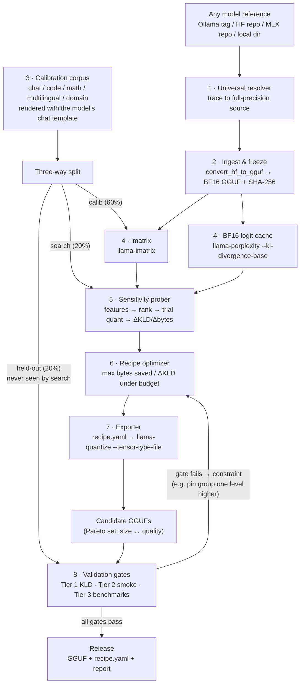

# OpenDynamicGGUF

**Automatic per-tensor mixed-precision GGUF quantization — for any model.**

Given any model reference (a Hugging Face repo, an Ollama tag like `functiongemma:latest`, an MLX repo like `gemma4:e2b-mlx`, or a local checkpoint), OpenDynamicGGUF automatically discovers the best quantization type for **every tensor group** under a size/VRAM budget, exports a ready-to-run GGUF, and proves the result with a multi-tier validation harness.

```bash
$ odg quantize --model functiongemma:latest --target-size 3.2GB

  → functiongemma-UD.gguf     # the dynamic-quantized model
  → recipe.yaml               # fully reproducible quantization recipe
  → report.html               # KLD / perplexity / benchmark validation report
```

Instead of a uniform preset like `Q4_K_M`, the output is a *recipe* — a measured, explainable, per-tensor-group bit assignment:

```
token_embd            -> Q8_0     (pinned: touched by every token)
attn_v    (all)       -> Q6_K     (pinned: high sensitivity, small size)
attn_q/k  (early)     -> Q5_K
attn_q/k  (mid/late)  -> Q4_K
ffn_gate  (mid)       -> Q3_K     (cheap bits: large tensor, low sensitivity)
ffn_up    (mid)       -> Q3_K
ffn_down  (all)       -> Q4_K
output                -> Q8_0     (pinned)
```

---

## Table of contents

1. [Why this project exists](#1-why-this-project-exists)
2. [Design principles](#2-design-principles)
3. [System architecture](#3-system-architecture)
4. [Stage 1 — Universal model resolver](#4-stage-1--universal-model-resolver)
5. [Stage 2 — Ingest & freeze reference](#5-stage-2--ingest--freeze-reference)
6. [Stage 3 — Calibration corpus & the three-way split](#6-stage-3--calibration-corpus--the-three-way-split)
7. [Stage 4 — Reference artifacts (compute once)](#7-stage-4--reference-artifacts-compute-once)
8. [Stage 5 — Sensitivity probing](#8-stage-5--sensitivity-probing)
9. [Stage 6 — Recipe optimizer](#9-stage-6--recipe-optimizer)
10. [Stage 7 — Reproducible export](#10-stage-7--reproducible-export)
11. [Stage 8 — Validation gates](#11-stage-8--validation-gates)
12. [One pipeline, every architecture](#12-one-pipeline-every-architecture)
13. [Recipe format](#13-recipe-format)
14. [Repository layout](#14-repository-layout)
15. [Roadmap / build order](#15-roadmap--build-order)
16. [Cost & hardware expectations](#16-cost--hardware-expectations)
17. [Related work & references](#17-related-work--references)

---

## 1. Why this project exists

The ecosystem has excellent quantization *methods* (GPTQ, AWQ, k-quants, IQ formats, imatrix) but no broadly adopted, **open** *automatic quantization optimizer* — a tool that, given a target size or memory budget, discovers the best tensor-wise precision assignment and exports a ready-to-use GGUF.

Unsloth's Dynamic 2.0 GGUFs proved the value of the idea: selectively assigning different bit-widths per tensor, guided by a curated calibration set and KL-divergence measurements, beats uniform quantization — especially for MoE models, where dynamic quantization has become the de-facto standard. But their exact heuristics and pipeline are proprietary. This project builds an **open, reproducible, measured** alternative:

- **Open**: every heuristic is code you can read.
- **Reproducible**: every released GGUF ships with a `recipe.yaml` that rebuilds it bit-for-bit.
- **Measured**: every bit decision traces back to a number produced by a sensitivity probe, not a hand-wave.

Crucially, we do **not** reimplement quantization kernels. `llama.cpp` already provides everything needed at the execution layer:

| Capability | llama.cpp tool |
|---|---|
| HF → GGUF conversion | `convert_hf_to_gguf.py` |
| Importance matrix from calibration text | `llama-imatrix` |
| Per-tensor quantization overrides (regex supported) | `llama-quantize --tensor-type`, `--tensor-type-file` |
| Embedding / output overrides | `--token-embedding-type`, `--output-tensor-type` |
| KL-divergence vs. full-precision logits | `llama-perplexity --kl-divergence-base` / `--kl-divergence` |
| Size estimation without writing files | `llama-quantize --dry-run` |

OpenDynamicGGUF is the **measurement, search, and validation loop around these tools**.

## 2. Design principles

1. **Never requantize quantized weights.** Quantization error compounds. Every input reference is traced back to its original full-precision source before anything else happens.
2. **KL divergence to the full-precision model is the primary objective** — not perplexity alone, and not benchmark scores during search. Logit-level fidelity is cheap to compute, sensitive, and doesn't saturate.
3. **Statistics prioritize; probes decide.** Mean, variance, sparsity, outlier ratio, norms, etc. are *features* used to rank groups and pick which bit-widths to try first. They are **never** the final accept/reject rule. Two layers can share identical statistics and still diverge wildly after quantization — only measured ΔKLD (or a similar output-distribution metric) is authoritative.
4. **Hard wall between search data and judging data.** The optimizer never sees the data it will be validated on. This is the single rule that keeps results honest instead of overfit to their own calibration set.
5. **Search over tensor groups, not individual tensors.** Role × depth grouping reduces ~300 tensors to ~25 groups, making the search tractable and the results interpretable.
6. **Everything is content-addressed and cached.** A re-run recomputes only what changed. Probes, logits, imatrices, and candidate GGUFs are keyed by the hash of their full input configuration.
7. **Gates are statistical where the metric is noisy.** Benchmark comparisons are paired per-question against the BF16 model with confidence intervals — never raw score thresholds.

## 3. System architecture



The dataflow in one paragraph: the resolver normalizes any model reference to full-precision weights; ingestion freezes a hashed BF16 GGUF that everything else derives from; the corpus manager builds chat-template-rendered calibration text and splits it three ways; the two expensive full-precision artifacts (imatrix, reference logits) are computed once and cached; the prober measures how much quality each tensor group loses per byte saved; the optimizer solves the resulting knapsack under the user's budget and emits a Pareto set of recipes; the exporter renders recipes into `llama-quantize` overrides; and the validation harness gates every candidate on data the search never saw, feeding failures back as constraints.

## 4. Stage 1 — Universal model resolver

The generalization that makes this work for *any* model: the pipeline never starts from what you typed — it starts from what the resolver traces it back to.

| You give it | What it actually is | Resolver action |
|---|---|---|
| `gemma4:e2b-mlx` | MLX repo — weights already 4-bit quantized | **Rejected as a source.** Traced to the original BF16 HF repo automatically |
| `functiongemma:latest` | Ollama tag → Q4 GGUF blob | Ollama manifest read; upstream fine-tune repo on HF resolved |
| `google/gemma-4-e2b-it` | BF16 safetensors on HF | Used directly |
| `./my-finetune/` | Local full-precision checkpoint | Used directly |

**Consumes:** any model reference.
**Produces:** BF16 safetensors + an *architecture descriptor* (family, layer count, MoE/SSM flags, chat template, specialty domain).
**Failure prevented:** requantizing already-quantized weights (MLX 4-bit, Ollama Q4). Quantization error compounds — no downstream search can recover it.

The architecture descriptor drives two later decisions: which tensor-group taxonomy to use (§12) and which domain data/checks to add (e.g. function-calling traces and JSON-validity gates for a `functiongemma`-style fine-tune).

## 5. Stage 2 — Ingest & freeze reference

```bash
python llama.cpp/convert_hf_to_gguf.py ./model-src --outtype bf16 --outfile model-bf16.gguf
sha256sum model-bf16.gguf   # recorded in every downstream artifact
```

**Consumes:** BF16 safetensors + architecture descriptor.
**Produces:** `model-bf16.gguf` (the frozen reference) + its SHA-256.
**Failure prevented:** sensitivity measured on one build while export runs on another — results become silently incomparable and the recipe stops being reproducible.

Sensitivity probing, export, and validation all derive from these exact bytes.

## 6. Stage 3 — Calibration corpus & the three-way split

The corpus is the text the quantization is optimized against. It must look like the model's real workload:

- **Domains:** conversation, code, reasoning/math, multilingual — plus the model's specialty domain from the resolver (e.g. real function-calling traces for a function-calling fine-tune).
- **Chat-template rendered:** instruct models run inside a chat template; calibration text must too. Raw wikitext calibration never exercises the format the model actually sees — a documented weakness of most community imatrix quants.
- **Scale:** roughly 0.3M–1.5M tokens depending on model size (in line with what Unsloth reports using).

Then it is split three ways, with a hard wall between splits:

| Split | Share | Used by | Purpose |
|---|---|---|---|
| **calib** | ~60% | `llama-imatrix` | Guides how each tensor is rounded |
| **search** | ~20% | Sensitivity prober & optimizer | The objective (ΔKLD) is computed here |
| **held-out** | ~20% | Validation gates **only** | The search never touches it |

**Failure prevented:** calibrating and evaluating on the same distribution. Most frameworks calibrate on Wikipedia-style text and then report KLD/perplexity on Wikipedia-style text — so the quants look better than they are. Splitting search data from judging data is the fix, and it is cheap.

## 7. Stage 4 — Reference artifacts (compute once)

Two expensive full-precision artifacts are computed exactly once and cached for every candidate that follows:

```bash
# Importance matrix (guides rounding within each tensor)
./llama-imatrix -m model-bf16.gguf -f calib.txt -o imatrix.gguf

# Reference logits (the thing every candidate is compared against)
./llama-perplexity -m model-bf16.gguf -f search.txt   --kl-divergence-base logits-search.bin
./llama-perplexity -m model-bf16.gguf -f heldout.txt  --kl-divergence-base logits-heldout.bin
```

**Failure prevented:** re-running the full-precision forward pass per candidate — the cost that makes naive search infeasible on a single workstation.

## 8. Stage 5 — Sensitivity probing

This is the heart of OpenDynamicGGUF. The search space is tamed by grouping tensors, **prioritized** with cheap statistics, then **decided** only by measured model behavior.

### Why statistics alone are not enough

Two layers can look identical on paper:

```
Layer A / Layer B
  Mean = 0    Variance = 0.05    Sparsity = 80%    Norm = 15
```

After the same Q4 probe, Layer A may show ΔKLD ≈ 0.002 (fine) while Layer B shows ΔKLD ≈ 0.12 (catastrophic). Thresholds like `if variance < 0.1 then compress` cannot see this. The true signal is **the model's sensitivity to quantizing that group**, measured by changing only that group and observing the shift in output distributions (KL divergence, top-token agreement, etc.).

So the rule is:

| Role of tensor features | Role of the probe |
|---|---|
| Mean, variance, sparsity, outlier ratio, activation range, weight / spectral norm, entropy | Trial-quantize one group; keep everything else BF16; measure ΔKLD on the search split |
| Used to **estimate difficulty** and **rank / prioritize** which groups and bit-widths to try first | Used to **accept / reject** and to fill the `(group, quant) → (Δbytes, ΔKLD)` table the optimizer consumes |

Features say *"probably easy"* or *"probably hard"*. The probe says *"how much quality you actually lose per byte saved."*

### Grouping

Tensors are grouped by **role × depth bucket**:

- Roles: `attn_q`, `attn_k`, `attn_v`, `attn_output`, `ffn_gate`, `ffn_up`, `ffn_down` (plus `_exps` variants for MoE, `ssm_*` for hybrids), `token_embd`, `output`.
- Depth buckets: early / middle / late layers.

That's **~25 groups instead of ~300 tensors** — tractable, and each group is human-meaningful.

### Probe pipeline (per group)

```
Tensor group
      │
      ▼
Extract features          ← cheap heuristics (prioritization only)
      │
      ▼
Estimate sensitivity score   e.g. weighted combo of variance, outliers,
                             spectral norm, activation range, entropy
      │
      ▼
Rank groups + choose trial bit-widths   (Q2 / Q3 / Q4 / Q5 / Q6…)
      │
      ▼
Trial quantization          only this group; rest stays BF16
      │
      ▼
Run search-split prompts    BF16 logits (cached) vs probe logits
      │
      ▼
Measure ΔKLD, top-token agreement, Δbytes
      │
      ▼
Record  bytes_saved / ΔKLD  ← what the optimizer actually maximizes
```

Concrete trial (only mid-layer `ffn_up` lowered):

```bash
./llama-quantize --imatrix imatrix.gguf \
    --tensor-type "\.(1[0-9])\.ffn_up=q3_k" \
    model-bf16.gguf probe-ffnup-mid.gguf q6_k

./llama-perplexity -m probe-ffnup-mid.gguf \
    --kl-divergence-base logits-search.bin --kl-divergence
```

How features help without becoming the decision:

```
High sparsity + low variance + few outliers  →  try Q3 first (probably easy)
Huge activation range + large spectral norm + many outliers  →  start at Q5/Q6 (probably hard)
```

If the Q3 probe returns ΔKLD ≈ 0.003 → keep Q3. If it returns ΔKLD ≈ 0.12 → reject and try Q4 / Q5. The sensitivity score never overrides a measured bad ΔKLD.

### Output — the sensitivity table

`(group, quant_type) → (Δbytes, ΔKLD)`. Δbytes is computed analytically from bits-per-weight × tensor shapes (`--dry-run` as a cross-check). Illustrative shape for a ~4B dense model:

| Tensor group | Probe | Size saved | ΔKLD (mean) | Decision |
|---|---|---|---|---|
| `ffn_up` · mid layers | Q4_K → Q3_K | −310 MB | +0.004 | Accept downgrade |
| `ffn_gate` · mid layers | Q4_K → Q3_K | −305 MB | +0.005 | Accept downgrade |
| `ffn_down` · mid layers | Q4_K → Q3_K | −180 MB | +0.019 | Keep Q4_K |
| `attn_v` · all layers | Q6_K → Q4_K | −45 MB | +0.037 | Pin Q6_K |
| `token_embd` | Q8_0 → Q4_K | −190 MB | +0.055 | Pin Q8_0 |

*(Illustrative values — real numbers come from your probe run. Large MLP tensors often buy cheap savings; attention and embeddings often buy expensive regret — but we only believe that after measuring.)*

**Failure prevented:** (1) blind search over an enormous per-tensor space, (2) false confidence from statistic thresholds that miss high-sensitivity layers with "easy-looking" distributions. Every final bit assignment traces back to a measured ΔKLD.

## 9. Stage 6 — Recipe optimizer

Bit assignment under a byte budget is (approximately) a **knapsack problem**:

1. **Greedy phase:** repeatedly downgrade the group with the best ratio of *bytes saved per unit of KLD incurred* until the size/VRAM budget is met. Per-group effects are roughly additive, so greedy gets ~90% of the way.
2. **Refinement phase:** short local search — single-group swaps, ±1 quant level — with *joint* measurement (quantize the full candidate, measure real KLD) to correct for interaction effects the additivity assumption misses.
3. **Output:** not one config, but the top few candidates along the **size ↔ quality Pareto frontier**.

v1 deliberately skips Bayesian optimization and evolutionary search: each objective evaluation costs a quantize + eval pass, and the published evidence (including Unsloth's own per-tensor-type findings) says greedy-plus-refinement captures what matters. Fancier search is a later experiment, not a prerequisite.

**Failure prevented:** a single opaque config. Emitting the whole frontier lets the user pick the trade-off and keeps every choice auditable.

## 10. Stage 7 — Reproducible export

A recipe is rendered into a `--tensor-type-file` and executed:

```bash
./llama-quantize --imatrix imatrix.gguf --tensor-type-file recipe.tt \
    --token-embedding-type q8_0 --output-tensor-type q8_0 \
    model-bf16.gguf model-UD.gguf q4_k_m
```

The recipe carries the **model hash, imatrix hash, and every group assignment**, so anyone can rebuild the GGUF bit-for-bit. Provenance metadata is embedded in the output file via `--override-kv`.

**Failure prevented:** "trust me" quants. Full reproducibility is this project's differentiator against closed dynamic-quant pipelines.

## 11. Stage 8 — Validation gates

Three cost-ordered tiers, **all on data the search never saw**. A candidate ships only after passing every gate.

### Tier 1 — Logit fidelity *(every candidate · minutes)*

`llama-perplexity --kl-divergence` against the cached BF16 logits on the **held-out split**.

Gates:

- **mean KLD** — overall fidelity
- **99.9th-percentile KLD** and **max KLD** — a good mean can hide catastrophic single-token failures; the tail gates catch them
- **top-token agreement rate** — fraction of positions where the quant's argmax matches BF16

### Tier 2 — Behavioral smoke *(Pareto-frontier candidates · ~1 hour)*

- Perplexity on an unrelated public set (different from anything used in calibration).
- Generation battery: chat coherence, code that must compile, exact-answer math, long-context retrieval.
- **Domain checks from resolver metadata** — e.g. every emitted tool call must be schema-valid JSON for a function-calling model.

Catches failure modes logit metrics miss: broken chat-template handling, degenerate repetition, formatting collapse.

### Tier 3 — Benchmarks *(final 1–2 candidates · hours)*

MMLU / GSM8K / HumanEval via lm-eval-harness (or llama.cpp server + a runner).

The gate is **statistical**: paired per-question comparison against the BF16 model, required to sit inside the confidence interval. Never a raw score threshold — benchmark noise would randomly pass and fail good quants.

### Feedback loop

A gate failure returns to the optimizer as a **concrete constraint**, not a blind restart. Example: a max-KLD breach is traced to the group that caused it (the sensitivity table makes the lookup trivial), that group is pinned one precision level higher, and the search re-runs — from cache, so only changed artifacts are recomputed.

**Failure prevented:** shipping a quant that only looks good on its own calibration data — the exact overfitting failure this whole design exists to avoid.

## 12. One pipeline, every architecture

The probe-and-search loop is identical for every model; only the **tensor taxonomy and default policies** adapt. The architecture descriptor from the resolver selects the profile.

### Dense transformers (e.g. `gemma4:e2b`)

MLP tensors dominate the byte count — that's where size is won. Attention and embeddings are where quality is lost.

| Tensor group | Typical sensitivity | Default policy (starting point for the probe) |
|---|---|---|
| `ffn_up` · `ffn_gate` | Low | Search down to Q3_K — largest tensors, cheapest bits |
| `ffn_down` | Medium | Search, typically lands one level above gate/up |
| `attn_q` · `attn_k` | Medium | Search Q4–Q5; early layers usually need more |
| `attn_v` · `attn_output` | High | Pin Q5_K–Q6_K — small tensors, outsized KLD impact |
| `token_embd` · `output` | Critical | Pin Q8_0 (or leave F16) — touched by every token |

### MoE models (e.g. Qwen-MoE / gpt-oss class)

Expert tensors are ~90% of the bytes, so dynamic assignment pays off most here — it's why dynamic quantization became the de-facto standard for MoE. Calibration also yields **expert-usage counts**: rarely-routed experts can take fewer bits.

| Tensor group | Typical sensitivity | Default policy |
|---|---|---|
| `ffn_up_exps` · `ffn_gate_exps` | Low | Quantize hard (Q2–Q3) — the bulk of the model |
| `ffn_down_exps` | Medium | One level above the up/gate experts |
| shared expert | High | Pin high — active on every token |
| router / gate | Critical | Pin — tiny tensor that controls all routing |
| `attn_*` | High | Pin Q5–Q6 |

### Hybrid / SSM models (Mamba–attention hybrids)

Published probes on hybrids (e.g. Unsloth's Qwen3.5 experiments) show the recurrent path is the trap: `ssm_out` at Q2_K explodes KLD for negligible savings, and the few attention layers present are extra sensitive.

| Tensor group | Typical sensitivity | Default policy |
|---|---|---|
| `ffn_*` | Low | Search as in dense models |
| `ssm_in` · `conv1d` | Medium | Search cautiously, one level at a time |
| `attn_*` (sparse layers) | High | Pin — few of them, they carry long-range mixing |
| `ssm_out` | Critical | Never below Q6 — max-KLD spike, minuscule savings |

### Fine-tunes (e.g. `functiongemma:latest`)

A fine-tune keeps the base architecture, so the taxonomy and the base model's recipe carry over as a **warm start** — but never as the final answer:

- **Reuse:** the tensor taxonomy and the base model's recipe initialize the search.
- **Change:** the calibration corpus must include the specialty domain — real function-calling traces rendered in the model's chat template — or the imatrix optimizes for the wrong distribution.
- **Re-probe:** fine-tuning shifts weight outliers, so sensitivity is re-measured (cheap, thanks to the cache).
- **Extra gate:** Tier 2 adds domain smoke tests — every emitted tool call must be schema-valid JSON before the quant can ship.

## 13. Recipe format

The unit of reproducibility. Sketch:

```yaml
# recipe.yaml
schema: odg/recipe/v1
model:
  source: google/gemma-4-e2b-it
  bf16_gguf_sha256: "9f2c…"
calibration:
  corpus_id: odg-corpus-v1
  imatrix_sha256: "77aa…"
  splits: { calib: 0.6, search: 0.2, heldout: 0.2, seed: 42 }
budget:
  target_size_gb: 3.2
base_type: q4_k_m
overrides:                        # rendered to --tensor-type-file at export
  token_embd: q8_0
  output: q8_0
  "\\.(\\d+)\\.attn_v": q6_k
  "\\.([0-9])\\.attn_q": q5_k     # early layers
  "\\.(1[0-9]|2[0-9])\\.ffn_up": q3_k
  "\\.(1[0-9]|2[0-9])\\.ffn_gate": q3_k
validation:
  tier1: { mean_kld: 0.0081, p999_kld: 0.41, max_kld: 2.9, top1_agree: 0.987 }
  tier3: { mmlu_paired_delta: -0.2, ci95: [-0.9, 0.5], pass: true }
```

`odg build recipe.yaml` reproduces the GGUF bit-for-bit from the same inputs.

## 14. Repository layout

```
opendynamicgguf/
├── odg/
│   ├── resolve.py       # any ref (Ollama / HF / MLX / local) → BF16 safetensors + descriptor
│   ├── ingest.py        # convert_hf_to_gguf → hashed BF16 GGUF
│   ├── corpus.py        # corpus build, chat-template render, 3-way split
│   ├── runners.py       # llama-imatrix / llama-quantize / llama-perplexity wrappers
│   ├── features.py      # per-group stats (mean/var/sparsity/outliers/norms…) — ranking only
│   ├── sensitivity.py   # features → rank → trial quant → ΔKLD/Δbytes table
│   ├── optimizer.py     # maximize bytes_saved/ΔKLD under budget → Pareto set
│   ├── recipe.py        # recipe.yaml ↔ --tensor-type-file rendering
│   ├── validate/
│   │   ├── tier1_kld.py
│   │   ├── tier2_smoke.py
│   │   ├── tier3_bench.py
│   │   └── gates.py
│   ├── cache.py         # content-addressed artifacts (config hash → GGUF/logits/KLD)
│   └── cli.py           # odg quantize --model … --target-size …
├── recipes/             # published, reproducible recipes per model
└── reports/             # per-run reports: metrics, gates, Pareto frontier
```

`cache.py` matters more than it looks: every artifact (GGUF, imatrix, logits, KLD result) is keyed by a hash of its full input configuration, so re-runs reuse everything unchanged and the ~25-group probe never re-measures what it already knows.

## 15. Roadmap / build order

Three shippable milestones — each independently useful before the next exists:

- **M1 — Runners + Tier-1 harness.** Subprocess wrappers for the llama.cpp tools plus the KLD gate. Useful standalone: audit any existing community GGUF and publish honest fidelity tables (mean/tail KLD, top-token agreement).
- **M2 — Features + sensitivity prober.** Cheap per-group feature extraction for ranking, then full trial-quantize probes that publish ΔKLD/Δbytes tables. The tables alone are novel, citable output; the features only accelerate which probes to run first.
- **M3 — Optimizer + full gate loop.** First end-to-end `odg quantize` producing a GGUF, a recipe, and a report.

Later experiments (explicitly *not* v1): smarter search (Bayesian/evolutionary), per-expert bit allocation from usage counts, KV-cache quantization sensitivity, attention-head/neuron-level importance, LLM-in-the-loop failure analysis suggesting recipe changes.

## 16. Cost & hardware expectations

For a 2–8B model on a single decent workstation (e.g. 24 GB GPU or Apple Silicon with 32 GB+):

| Step | Rough cost |
|---|---|
| Convert + hash | minutes |
| imatrix + reference logits | tens of minutes (one-time per model/corpus) |
| One probe (quantize + Tier-1 eval) | ~5–15 minutes |
| Full ~25-group probe sweep | overnight, embarrassingly parallel |
| Greedy + refinement (~10 joint evals) | a few hours |
| Tier 3 benchmarks (final candidates) | hours |

Nothing here needs a cluster. For 70B+ or big MoE models, the same pipeline applies — the probe sweep just wants a bigger box or more patience.

## 17. Related work & references

Study these before/while building — the design above borrows deliberately from what's publicly known:

- **Unsloth Dynamic 2.0 GGUFs** — publicly described concepts: per-layer/per-tensor dynamic bit assignment, curated chat/code calibration data (300K–1.5M tokens), KLD-first evaluation, calibration-overfitting critique, per-tensor-type sensitivity findings (attn sensitive; `ffn_up/gate` cheap; `ssm_out` critical). [docs](https://unsloth.ai/docs/basics/unsloth-dynamic-2.0-ggufs) · [blog](https://www.unsloth.ai/blog/dynamic-v2)
- **llama.cpp quantize tool** — `--tensor-type` / `--tensor-type-file` per-tensor overrides, imatrix, `--dry-run`. [tools/quantize README](https://github.com/ggml-org/llama.cpp/blob/master/tools/quantize/README.md)
- **llama.cpp imatrix + KLD tooling** — `llama-imatrix`, `llama-perplexity --kl-divergence`.
- **E. Addario's layer-wise quantization work** — LWQ/TWQ with `--tensor-type`, imatrix statistics to guide assignment. [HF post](https://huggingface.co/posts/eaddario/332413870990082)
- **Calibration sets** — bartowski's Calibration_v3 / v5 gists (used widely for fair KLD testing).
- **GPTQ** ([arXiv:2210.17323](https://arxiv.org/abs/2210.17323)), **AWQ**, **SmoothQuant**, **HQQ**, **AQLM** — post-training quantization methods and calibration methodology.
- **"Accuracy is not all you need"** — motivation for KLD/agreement metrics over accuracy-only evaluation of compressed models.
- **Mixed-precision / KL-sensitivity literature** — statistics-as-prior, KL-as-decision (e.g. mixed-precision LM quantization for speech; forward-only KL sensitivity for mixed-precision SSM–Transformer models). Confirms: features rank candidates; measured ΔKL allocates bits.
- **lm-evaluation-harness** — Tier-3 benchmark runner.

---

*License: intended Apache-2.0. Contributions welcome once M1 lands.*
